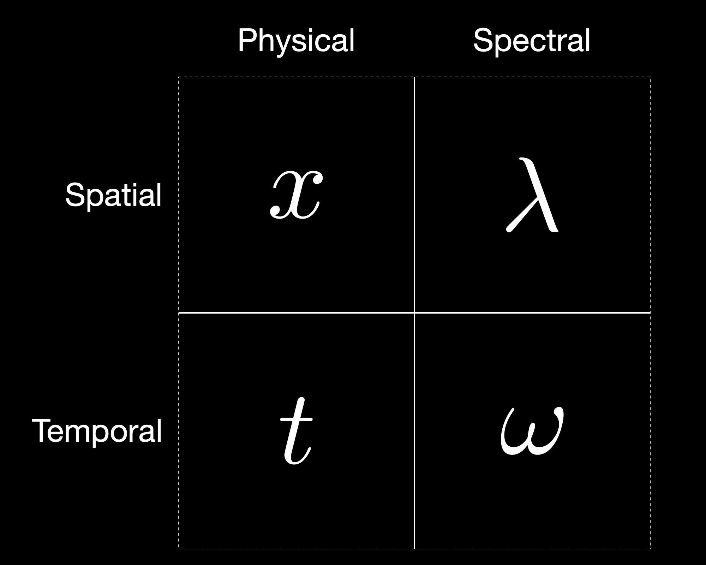

```{r, echo=F, message=F, include=F}
devtools::load_all(".")
source('./man/code/plot.R')
source('./man/code/utils.R')
knitr::opts_chunk$set(
  collapse = TRUE,
  comment = "#>",
  fig.path = "man/figures/README-",
  warning = FALSE, 
  message = FALSE,
  fig.crop= T
)
```

# The Behavioral Data

## Manipulating Harmonic Frequencies

```{r, include=F}
timbre_paper = readRDS('./man/data/output/readme.rds')
```

```{r, include=F}
dyads <- timbre_paper %>% dplyr::rowwise() %>% dplyr::mutate(
  type          = metadata$type,
  num_harmonics = metadata$num_harmonics,
  pseudo_octave = metadata$pseudo_octave,
  semitone      = metadata$semitone,
  timbre        = metadata$timbre,
  label         = round(metadata$semitone),
  chord_max     = max(frequencies),
  chord_min     = min(frequencies),
  .before=1
)
```

```{r, fig.height=8, fig.width=12, echo=F, results='asis', message=F}
params = list(
  list(h=5, o=2.0,t='5Partials'), # all signals will agree
  list(h=10,o=2.0,t='Harmonic'), # all signals will agree
  list(h=10,o=2.0,t='M3'), # adding place signals
  list(h=10,o=2.0,t='M6'), # adding place signals
  list(h=4, o=2.0,t='Bonang'), # alignment with roughness and periodicity
  list(h=10,o=2.1,t='Stretched'), # uncertainty limit is the same
  list(h=10,o=1.9,t='Compressed'), # uncertainty limit is the same
  list(h=1, o=2.0,t='Pure'), # the cochlear distortion works around the HUP limit
  list(h=5, o=2.0,t='5PartialsNo3'), # major minor hypothesis
  list(h=10,o=2.0,t='P8'), # squint to see this
  list(h=10,o=2.0,t='m3'), # future predictions
  list(h=10,o=2.0,t='m6'), # future predictions
  list(h=10,o=2.0,t='P1'), # future predictions
  list(h=10,o=2.2,t='ExtraStretched'), # future predictions
  list(h=10,o=1.87,t='ExtraCompressed'), # future predictions
  list(h=2, o=2.0,t='2PartialsFramed') # future predictions
)

BEHAVIOURAL_SMOOTH_BROAD  <- 0.2
BEHAVIOURAL_SMOOTH_NARROW <- 0.035

behavioral_data_available = T

min_semitone=0
max_semitone=12
include_extreme_labels=T
N=0

p = params %>% purrr::map(\(p) {
  if (p$o==2 & p$h==10 & p$t == 'Harmonic') {
    black_vlines  = c(2,3,4,5,7,8,9,12)
    gray_vlines = c()
    description   = ''
    sigma = BEHAVIOURAL_SMOOTH_BROAD
    N = 198
  } else if (p$o==2 & p$h==5 & p$t == '5Partials') {
    black_vlines  = c(3,4,5,7,9,12,14)
    gray_vlines = c()
    description   = ''
    sigma = BEHAVIOURAL_SMOOTH_BROAD
    N = 149
  } else if (p$o==2 & p$h==5 & p$t == '5PartialsNo3') {
    black_vlines  = c(4,5,7,9,12,14)
    gray_vlines = c()
    description   = ''
    sigma = BEHAVIOURAL_SMOOTH_BROAD
    N = 160
  } else if (p$o==2 & p$h==1 & p$t == 'Pure') {
    black_vlines  = c(7,12)
    gray_vlines = c()
    description   = ''
    sigma = BEHAVIOURAL_SMOOTH_BROAD
    N = 176
  } else if (p$o>2 & p$t == 'Stretched') {
    black_vlines  = c(4.2,7.5,9.4,12.78)
    gray_vlines = c()
    description   = ''
    sigma = BEHAVIOURAL_SMOOTH_BROAD
    N = 194
  } else if (p$o<2 & p$t == 'Compressed') {
    black_vlines  = c(3.8,4.8,11.1,14.5)
    gray_vlines = c()
    description   = ''
    sigma = BEHAVIOURAL_SMOOTH_BROAD
    N = 202
  } else if (p$t == 'Bonang') {
    black_vlines = c(2.60, 4.80, 12.0)
    gray_vlines  = c(7.2, 9.6)
    description   = ''
    sigma = BEHAVIOURAL_SMOOTH_BROAD
    N = 170
  } else if (p$t == 'M3') {
    gray_vlines = c(hrep::freq_to_midi(hrep::midi_to_freq(60) * 5/4)-60,4,4.092442)
    black_vlines  = c(3.95)
    description   = ''
    sigma = BEHAVIOURAL_SMOOTH_NARROW
    include_extreme_labels=F
    N = 237
  } else if (p$t == 'M6') {
    gray_vlines = c(hrep::freq_to_midi(hrep::midi_to_freq(60) * 5/3)-60,9,8.66952)
    black_vlines  = c(8.78,8.93)
    description   = ''
    sigma = BEHAVIOURAL_SMOOTH_NARROW
    include_extreme_labels=F
    N = 230
  } else if (p$t == 'P8') {
    gray_vlines = c(hrep::freq_to_midi(hrep::midi_to_freq(60) * 2/1)-60)
    black_vlines  = c(11.94, 12.08)
    description   = ''
    sigma = BEHAVIOURAL_SMOOTH_NARROW
    min_semitone=1
    max_semitone=13
    include_extreme_labels=F
    N = 196
  } else if (p$t == 'm3') {
    gray_vlines = c(hrep::freq_to_midi(hrep::midi_to_freq(60) * c(6/5))-60,3)
    black_vlines  = c()
    description   = ''
    sigma = BEHAVIOURAL_SMOOTH_NARROW
    behavioral_data_available = F
    include_extreme_labels=F
  } else if (p$t == 'm6') {
    gray_vlines = c(hrep::freq_to_midi(hrep::midi_to_freq(60) * c(8/5))-60,8.0)
    black_vlines  = c()
    description   = ''
    sigma = BEHAVIOURAL_SMOOTH_NARROW
    behavioral_data_available = F
    include_extreme_labels=F
  } else if (p$t == 'P1') {
    gray_vlines = c(0.0)
    black_vlines  = c()
    description   = ''
    sigma = BEHAVIOURAL_SMOOTH_NARROW
    behavioral_data_available = F
    min_semitone=-1
    max_semitone=1
    include_extreme_labels=F
  } else if (p$o>2 & p$t == 'ExtraStretched') {
    black_vlines  = c()
    gray_vlines = c()
    description   = 'Thus, 2.2 is stretched a bit too far, and ... (Sethares)'
    sigma = BEHAVIOURAL_SMOOTH_BROAD
    behavioral_data_available = F
  } else if (p$o<2 & p$t == 'ExtraCompressed') {
    black_vlines  = c()
    gray_vlines = c()
    description   = '... 1.87 is squished a bit too much. (Sethares)'
    sigma = BEHAVIOURAL_SMOOTH_BROAD
    behavioral_data_available = F
  } else if (p$o==2 & p$h==2 & p$t == '2PartialsFramed') {
    black_vlines  = c()
    gray_vlines = c()
    description   = ''
    sigma = BEHAVIOURAL_SMOOTH_BROAD
    behavioral_data_available = F
  }
  
  title = paste(
    p$t,
    '~',
    'Partials:', p$h
  )

  chords <- dyads %>% dplyr::filter(timbre == p$t)

  chords$consonance_z = z_scores(-chords$dissonance)
  chords$majorness_z = z_scores(chords$majorness)
  
  chords$space_periodicity = -chords$space_periodicity
  chords$time_periodicity = -chords$time_periodicity
  
  chords$space_periodicity_z = z_scores(chords$space_periodicity)
  chords$time_periodicity_z = z_scores(chords$time_periodicity)
  
  chords$periodicity_z = z_scores(-chords$periodicity)

  chords$time_roughness = -chords$time_roughness
  chords$time_roughness_z = z_scores(chords$time_roughness)
  
  chords$space_roughness = -chords$space_roughness
  chords$space_roughness_z = z_scores(chords$space_roughness)
  
  chords$roughness_z = z_scores(-chords$roughness)
  
  chords$ropey = chords$roughness - chords$periodicity
  
  chords$space_consonance_z = z_scores(-chords$space_dissonance)
  chords$time_consonance_z = z_scores(-chords$time_dissonance)
  
  if (behavioral_data_available) {
    
    experiment.rds = paste0('./man/data/input/',
                            p$t,
                            '.rds')
    
    experiment_all = readRDS(experiment.rds)
    
    experiment = experiment_all$profile %>%
      dplyr::rename(semitone=interval)
    
    experiment <- experiment %>% dplyr::mutate(
      consonance = rating
    )
    
    experiment_raw = experiment_all$data %>% 
      dplyr::rename(semitone=interval, 
                    consonance_z=rating)
  } else {
    experiment = NULL
  }
  
  if (p$t=='5Partials') {
    cat('  \n#### Dyads spanning 15 semitones\n')
  }
  if (p$t=='M3') {
    cat('  \n#### Dyads spanning 1 quarter tone\n')
  }
  if (p$t=='m3') {
    cat('  \n#### Predictions ~ No behavioral data\n')
  }
  cat("  \n#####", title, '\n')
  
  cat("  \n", description, '\n')
  
  print(plot_semitone_codi(chords, paste0(p$t, ' (N=', N,' participants) : Consonance-Dissonance: Periodicity + Smoothness'),
                           goal=experiment,sigma=sigma,
                           black_vlines=black_vlines,gray_vlines=gray_vlines))
  cat("  \n")
  
  print(plot_semitone_periodicity_roughness(chords, paste0(p$t, ' (N=', N,' participants) : Consonance: Periodicity & Smoothness'),
                                            goal=experiment,sigma=sigma,
                                            black_vlines=black_vlines,gray_vlines=gray_vlines))
  cat("  \n")
  
  print(plot_semitone_periodicity_space_time(chords, paste0(p$t, ' (N=', N,' participants) : Periodicity: Space & Time'),
                                             goal=experiment,sigma=sigma,
                                             black_vlines=black_vlines,gray_vlines=gray_vlines))
  cat("  \n")
  
  print(plot_semitone_roughness_space_time(chords,title = paste0(p$t, ' (N=', N,' participants) : Smoothness: Space & Time'),
                                          goal=experiment, sigma=sigma,
                                           black_vlines = black_vlines,gray_vlines  = gray_vlines)
  )
  cat("  \n")
  
  print(plot_semitone_mami(chords, paste0(p$t, ' (N=', N,' participants) : Major-Minor: Time Consonance minus Space Consonance'),
                           goal=experiment,sigma=sigma,
                           black_vlines=black_vlines,gray_vlines=gray_vlines))
  cat("  \n")
  
  print(plot_mami_codi(chords, 
                       min_semitone=min_semitone,max_semitone=max_semitone,
                       include_extreme_labels=include_extreme_labels,
                       paste0(p$t, ': Consonance-Dissonance versus Major-Minor'), sigma=sigma))
  cat("  \n")
  
  print(plot_roughness_periodicity(chords, 
                                   min_semitone=min_semitone,max_semitone=max_semitone,
                                   include_extreme_labels=include_extreme_labels,
                                   paste0(p$t, ': Smoothness versus Periodicity'), sigma=sigma))
  cat("  \n")
  
})
```

# Fourier uncertainty principle in number‑theoretic form matches musical consonance perception

## Heisenberg Uncertainty

$$
\boxed{\Delta x \Delta p \ge \frac{\hbar}{2}, \quad  \lambda = \frac{h}{p}}
$$

When de Broglie gave matter a wavelength, did he give us a pattern recognition problem?

## Gabor Uncertainty




*"Each of these areas, with its associated datum, represents, as it were, one **elementary quantum of information**, and it is proposed to call it a **logon**." -Gabor, 1944*

*"...phase-space is subdivided in **quantum blobs**..." -de Gasson, 2002*


$$
\boxed{\Delta t \Delta \omega \ge \frac{1}{2}}
$$

## Relative Uncertainty

### Reference Time Period

$$
\Delta t = \tau T_{ref}  = \tau \frac{2 \pi }{n \omega_{ref}}, \quad \tau \in \mathbb{R} \enspace \text{periods}, \quad n \in \mathbb{Z} \enspace \text{harmonics}
$$

$$
\tau \frac{2 \pi}{n \omega_{ref}}\Delta \omega \ge \frac{1}{2}
$$

### Relative Frequency Uncertainty

$$
\frac{\Delta \omega}{n \omega_{ref}} \ge \frac{1}{4 \pi \tau}
$$

$$
\boxed 
{
\frac{\Delta f}{n f_{ref}} \ge \frac{1}{4 \pi \tau}
}
$$


## Relative Rational Approximation Uncertainty

### Idealized Frequency and Approximate Frequency

$$
\Delta f = \bigl| \widetilde f - f \bigr|
$$

$$
\begin{align*}
f   \text{is an idealized frequency} \\
\widetilde f   \text{is an approximate frequency} \\
\end{align*}
$$

### Rational Approximation

$$
\widetilde f = n f_{ref} \frac{a}{b}, \quad a \in \mathbb{Z},  b \in  \mathbb{N}
$$

### Rational Approximation Uncertainty

$$
\Delta f = 
\bigl| n f_{ref}  \frac{a}{b} - f\bigr| = 
\frac{n f_{ref}}{n f_{ref}} \bigl| n f_{ref} \frac{a}{b} - f \bigr| = 
n f_{ref} \bigl| \tfrac{a}{b} - \tfrac{f}{n f_{ref}}\bigr|
$$

$$
\frac{\Delta f}{n f_{ref}} = 
\frac{n f_{ref} \bigl| \frac{a}{b} - \frac{f}{n f_{ref}} \bigr|}{n f_{ref}} \ge \frac{1}{4 \pi \tau}
$$

$$
\boxed {
\bigl| \frac{a}{b} - \tfrac{f}{n f_{ref}} \bigr| \ge \frac{1}{4 \pi \tau}
}
$$

$$
n = \mathrm{round}\bigl(\frac{f}{f_{ref}}\bigr)
$$

## Stern-Brocot: Traversal

$$
\begin{aligned}
&\mathbf{WHILE} 
\boxed {
\Bigl|\tfrac{a}{b} - \tfrac{f}{n f_{\mathrm{ref}}}\Bigr| \ge \tfrac{1}{4\pi \tau}
}
\quad\mathbf{DO}\\
&\quad a  \gets  a_{\mathrm{left}} + a_{\mathrm{right}}\\
&\quad b  \gets  b_{\mathrm{left}} + b_{\mathrm{right}}\\
&\quad \mathbf{IF} \tfrac{f}{n f_{\mathrm{ref}}} > \tfrac{a}{b} \mathbf{THEN}\\
&\quad\quad a_{\mathrm{left}} \gets a,\quad b_{\mathrm{left}} \gets b\\
&\quad \mathbf{ELSE}\\
&\quad\quad a_{\mathrm{right}} \gets a,\quad b_{\mathrm{right}} \gets b\\
&\quad \mathbf{END\_IF}\\
&\quad d \gets d + 1\\
&\mathbf{END\_WHILE}
\end{aligned}
$$

### Stern-Brocot Example

```{r, fig.height=8, fig.width=12, echo=F, results='asis', message=F, include=F}
  C4 = round(hrep::midi_to_freq(60),4)
  B4 = round(hrep::midi_to_freq(71),4)
  sb = rational_fractions(B4, C4, UNCERTAINTY_LIMIT)
```

Let's find the rational approximation of two example frequencies that form a Major 7th interval:

$$
f_{\mathrm{ref}} = `r C4`\ \text{(C4)},
\quad
f = `r B4`\ \text{(B4)}
$$

```{r, fig.height=8, fig.width=12, echo=F, results='asis', message=F}
  M7 <- hrep::pi_chord(c(60, 71))

  plot(hrep::sparse_fr_spectrum(M7, num_harmonics=1),
       xlim = c(0, 1500))
  title("Pure Tone Major 7th of C4 and B4")
  cat("  \n")
```

We traverse the Stern–Brocot tree to a depth of **`r  sb$depth`** levels along the path **`r sb$path`** 
landing us on the fraction $\frac{`r sb$num`}{`r sb$den`}$.

$$
\bigl| \tfrac{`r B4`}{`r C4`} - \tfrac{`r sb$num`}{`r sb$den`}\bigr| = 
\bigl| `r round(B4/C4,4)`  - `r round(sb$num/sb$den,4)` \bigr| =
`r round(abs(B4/C4 - sb$num/sb$den),4)` < 
\frac{1}{4 \pi} =
`r round(UNCERTAINTY_LIMIT, 4)`
$$

```{r, fig.height=8, fig.width=12, echo=F, results='asis', message=F}

  coprimer::plot_stern_brocot_tree(sb$depth, sb$path, dark_mode=T)
  cat("  \n")
  
```

### Stern–Brocot: Rational Fractions Lowest Terms

$$
\mathrm{gcd}(a,b)=1 \quad \Longrightarrow \quad a \perp b \quad  \Longrightarrow \quad \frac{a}{b} \in \mathbb{Q_\perp}
$$

## Number-Theoretic Signal Processing

$$
f_0 = f_{ref}\frac{\mathrm{gcd}(a_1, a_2, \dots, a_N)}{\mathrm{lcm}(b_1, b_2, \dots, b_N)}, \quad f_{ref} = \mathrm{min}(f_1, f_2, \dots, f_N), \quad a_i \perp b_i
$$

### Rational Approximation Signal versus Idealized Signal

Idealized Frequencies:

```{r, fig.height=8, fig.width=12, echo=F, results='asis', message=F}
M7 <- hrep::sparse_fr_spectrum( hrep::pi_chord(c(60, 71)), num_harmonics=1)

vals <- sprintf("%.2f", M7$x)
f_list <- paste(vals, collapse = ", ")
cat(sprintf("  \n$$\\mathbf{f} = ( %s )$$  \n", f_list))
```

Equation for Rational Fraction Frequencies:

$$
\mathbf{f} = f_{ref} \cdot \bigl( \frac{a_i}{b_i},\frac{a_i}{b_i},\dots,\frac{a_N}{b_N} \bigr)
$$

$$
\mathbf{f} = `r round(C4,4)`  \cdot \bigl( \frac{1}{1},\frac{11}{6} \bigr)
$$

M7 Signal from Coprime Spectrum:

```{r, fig.height=8, fig.width=12, echo=F, results='asis', message=F}
M7_mami_codi = mami.codi.beaty(M7, verbose=T)
number_of_periods_to_plot = 5
plot_period = number_of_periods_to_plot * M7_mami_codi$fundamental_period
C4 = hrep::midi_to_freq(60)
B4_rational = C4 * sb$approximation
M7_rational = hrep::sparse_fr_spectrum(list(frequency=c(C4,B4_rational), amplitude=c(1,1)), num_harmonics=1)
vals <- sprintf("%.2f", M7_rational$x)
f_list <- paste(vals, collapse = ", ")
cat(sprintf("  \n$$\\mathbf{f} = ( %s )$$  \n", f_list))
```

```{r, fig.height=8, fig.width=12, echo=F, results='asis', message=F}
par(
  bg       = "black",   # plotting region background
  fg       = "white",   # default for lines and text
  col      = "white",   # default color for points/lines
  col.axis = "white",   # axis tick labels
  col.lab  = "white",   # axis labels
  col.main = "white"    # main title
)

plot(hrep::wave(M7, length_sec = plot_period))
title("Original Signal of Pure Tone M7")
cat("  \n")

plot(hrep::wave(M7_rational, length_sec = plot_period))
abline(
  v   = seq(0, plot_period, by = M7_mami_codi$fundamental_period),
  lty = "dashed"
)
title(
  paste(
    "Rational-Fraction Signal of Pure Tone M7 f0:", 
    round(M7_mami_codi$fundamental_frequency, 4), 
    "Hz  T0:", 
    round(M7_mami_codi$fundamental_period, 4),
    "s  plotted over",
    number_of_periods_to_plot,
    "periods"
    ))
cat("  \n")
```


Major Triad Signal from Coprime Spectrum:

```{r, fig.height=8, fig.width=12, echo=F, results='asis', message=F}
MT_mami_codi = mami.codi.beaty(c(60,64,67), verbose=T, num_harmonics=1)
MT_freqs = MT_mami_codi$frequency_spectrum[[1]]$frequency
MT_sparse_fr_spectrum = hrep::sparse_fr_spectrum(list(frequency=MT_freqs, amplitude=rep(1,length(MT_freqs))))
MT_rational_freqs = C4 * MT_mami_codi$time_fractions[[1]]$approximation
MT_rational_sparse_fr_spectrum = hrep::sparse_fr_spectrum(list(frequency=MT_rational_freqs, amplitude=rep(1,length(MT_rational_freqs))))
```

```{r, fig.height=8, fig.width=12, echo=FALSE, results='asis', message=FALSE}
# prepare values
n          <- 5
plot_period <- n * MT_mami_codi$fundamental_period
f0_val     <- round(MT_mami_codi$fundamental_frequency, 4)
T0_val     <- round(MT_mami_codi$fundamental_period,      4)
plot_time = T0_val * n
# unified black-bg/white-fg styling
par(
  bg       = "black",
  fg       = "white",
  col      = "white",
  col.axis = "white",
  col.lab  = "white",
  col.main = "white",
  col.sub  = "white"
)


plot(MT_sparse_fr_spectrum,
     xlim = c(100, 500))
title(
  main = bquote(
    atop(
      "Spectrum of Pure Tone ET Major Triad with Cubic Difference Tones",
      "Plot: 100 to 500 Hz"
    )
  )
)
cat("\n\n")

# first signal
plot(
  hrep::wave(MT_sparse_fr_spectrum, length_sec = plot_period),
  type = "l",
  xlab = "Time (s)",
  ylab = "Amplitude"
)
title(
  main = bquote(
    atop(
      "Signal of Pure Tone ET Major Triad with Cubic Difference Tones",
      "Plot:" ~ .(plot_time) ~ "s"
    )
  )
)
cat("\n\n")

# rational-fraction signal
plot(
  hrep::wave(MT_rational_sparse_fr_spectrum, length_sec = plot_period),
  type = "l",
  xlab = "Time (s)",
  ylab = "Amplitude"
)
abline(
  v   = seq(0, plot_period, by = MT_mami_codi$fundamental_period),
  lty = "dashed"
)

# two-line title with true subscripts via plotmath
title(
  main = bquote(
    atop(
      "Coprime Signal of Pure Tone ET Major Triad with Cubic Difference Tones",
      f[0] == .(f0_val) ~ "Hz  | " ~
      T[0] == .(T0_val) ~ "s  | " ~
      "Plot:"  ~ .(plot_time) ~ "s (" ~ .(n) ~ "periods )"
    )
  )
)
cat("  \n")
```


## Is This a Bad Idea?

For \(n = 1\), the resolution of pure-tone frequency ratios is poor. 
However, our auditory-system model explains how, despite this limitation, 
we can still perceive the difference between a unison (P1) and a minor second (m2).

```{r, echo=FALSE, results='asis'}
# your inputs
C4         <- hrep::midi_to_freq(60)
Db4        <- hrep::midi_to_freq(61)
freqs      <- c(C4, Db4)
results    <- rational_fractions(freqs, C4, uncertainty())

# build the columns
interval   <- c("P1", "m2")
num        <- results[,1]
den        <- results[,2]
ref_freq   <- rep(C4, length(freqs))

# now emit a *completely blank* line, then the table header
cat("\n\n",
    "| Interval | f     | ref  | Ratio | Uncertainty |", "\n",
    "|:---------|------:|-------:|------------:|------------:|", "\n",
    # one row per observation:
    paste0(
      "| ", interval,
      " | ", sprintf("%.3f", freqs),
      " | ", sprintf("%.3f", ref_freq),
      " | ", num, ':', den,
      " | ", "1/4π",
      " |"
    , collapse = "\n"),
    "\n\n",
    sep = ""
)
```

## Fundamental Wavelength of a N-Tone Chord

$$
\lambda_0 = \lambda_{ref} \frac{\mathrm{lcm}(b_1, b_2, \dots, b_N)}{\mathrm{gcd}(a_1, a_2, \dots, a_N)}, \quad \lambda_{ref} = \mathrm{min}(\lambda_1, \lambda_2, \dots, \lambda_N), \quad a_i \perp b_i
$$

## Stolzenburg Periodicity Perception

### Fundamental Cycle Length of a N-Tone Chord

$$
L  = \mathrm{lcm}(b_1,b_2,\dots,b_N)
\quad\text{when}\quad
\gcd(a_1,\dots,a_N)=1
$$

### Periodicity: Rational Approximation Cycle Length

$$
P_f  = \log_2 \bigl(L_f\bigr) \quad \text{and} \quad P_\lambda  = \log_2 \bigl(L_\lambda\bigr) \quad \text{[Proposed Units: Sz]}
$$

#### Bonang: MaMi.CoDi.Beaty Periodicity with Harrison & Pearce 2018

We use a simulated Bonang spectrum. Here is an example unison P1 pitch at C4.

```{r, fig.height=8, fig.width=12, echo=F, results='asis', message=F}
bonang_simulus_harmonics = c(1.0, 1.52, 3.46, 3.92)
bonang_simulus_spectrum = hrep::sparse_fr_spectrum(list(frequency=C4 * bonang_simulus_harmonics, amplitude=rep(1, length(bonang_simulus_harmonics))))
bonang_mami_codi = mami.codi.beaty(bonang_simulus_spectrum, verbose=T)
bonang_freqs = bonang_mami_codi$frequency_spectrum[[1]]$frequency
bonang_sparse_fr_spectrum = hrep::sparse_fr_spectrum(list(frequency=bonang_freqs, amplitude=rep(1,length(bonang_freqs))))
bonang_rational_freqs = C4 * bonang_mami_codi$time_fractions[[1]]$approximation
bonang_rational_sparse_fr_spectrum = hrep::sparse_fr_spectrum(list(frequency=bonang_rational_freqs, amplitude=rep(1,length(bonang_rational_freqs))))
```

```{r, fig.height=8, fig.width=12, echo=F, results='asis', message=F}
par(
  bg       = "black",
  fg       = "white",
  col      = "white",
  col.axis = "white",
  col.lab  = "white",
  col.main = "white",
  col.sub  = "white"
)
plot(bonang_sparse_fr_spectrum,
     xlim = c(0, 1250))
title("Simulated Bonang Spectrum with Cubic Difference Tones")
cat("  \n")
```

```{r, fig.height=8, fig.width=12, echo=F, results='asis', message=F}
  chords <- dyads %>% dplyr::filter(timbre == 'Bonang')
  chords$periodicity_z = z_scores(-chords$periodicity)

  HarrisonPearce2018.rds = paste0('./man/data/output/HarrisonPearce2018.rds')
  HarrisonPearce2018_all = readRDS(HarrisonPearce2018.rds)
  HarrisonPearce2018 = HarrisonPearce2018_all$summary %>% dplyr::rename(semitone=interval)
  HarrisonPearce2018 <- HarrisonPearce2018 %>% dplyr::mutate(
    consonance_z=z_scores(output)
  )
  
  print(plot_semitone_periodicity_model_compare(chords, 'Bonang: MaMi.CoDi.Beaty Periodicity with Harrison & Pearce 2018',
                                             goal=HarrisonPearce2018,model_name='HarrisonPearce2018',
                                             black_vlines=c(),gray_vlines=c()))
  cat("  \n")
  
```


### Roughness: Stern-Brocot Traversal Depth

#### Stern–Brocot: Total Traversal Depth for All Tones in a N-Tone Chord

$$
D  =  \sum_{i=1}^{N} d_{i}
$$

#### Stern–Brocot: Psychophysical Measure of Roughness

$$
R_f  = \log_2 \bigl(D_f\bigr) \quad \text{and} \quad R_\lambda  = \log_2 \bigl(D_\lambda\bigr)
$$

#### Bonang: MaMi.CoDi.Beaty Roughness with Hutchinson & Knopoff 1978

```{r, fig.height=8, fig.width=12, echo=F, results='asis', message=F}
  chords <- dyads %>% dplyr::filter(timbre == 'Bonang')
  chords$roughness_z = z_scores(-chords$roughness)
  

  HutchinsonKnopoff1978Revised.rds = paste0('./man/data/output/HutchinsonKnopoff1978Revised.rds')
  HutchinsonKnopoff1978Revised_all = readRDS(HutchinsonKnopoff1978Revised.rds)
  HutchinsonKnopoff1978Revised = HutchinsonKnopoff1978Revised_all$summary %>% dplyr::rename(semitone=interval)
  HutchinsonKnopoff1978Revised <- HutchinsonKnopoff1978Revised %>% dplyr::mutate(
    consonance_z=z_scores(output)
  )
  
  print(plot_semitone_roughness_model_compare(chords, 'Bonang: MaMi.CoDi.Beaty Roughness with Hutchinson & Knopoff 1978',
                                             goal=HutchinsonKnopoff1978Revised,model_name='HutchinsonKnopoff1978Revised',
                                             black_vlines=c(),gray_vlines=c()))
  cat("  \n")
```


### Overall Frequency Dissonance

$$
\psi_f = P_f + R_f
$$

### Overall Wavelength Dissonance

$$
\psi_\lambda = P_\lambda + R_\lambda
$$

### Consonance-Dissonance: Frequency and Wavelength Dissonance Sum

$$
\boxed{
\Psi_{CoDi}  = \psi_\lambda + \psi_f
}
$$

### Major-Minor: Frequency and Wavelength Dissonance Difference

$$
\boxed {
\Psi_{MaMi}  = \psi_\lambda - \psi_f
}
$$

### Beating: Frequency and Wavelength Roughness

$$
\boxed{
\Psi_{Beaty}  = R_\lambda + R_f
}
$$

## Pseudo-Octaves: Stretching and Compressing Harmonics

$$
\boxed{\Delta t \Delta \omega \ge \frac{1}{2}}
$$

### Harmonic Reference Time Period


$$
\Delta t = \tau \frac{T_{ref}}{n} = \tau \frac{2 \pi }{n \omega_{ref}}, \quad \tau \enspace \text{periods}, \quad n \in \mathbb{Z} \quad \text{harmonic number}
$$

$$
\tau \frac{2 \pi}{n \omega_{ref}}\Delta \omega \ge \frac{1}{2}
$$


### Relative Harmonic Frequency Uncertainty

$$
\frac{\Delta \omega}{n \omega_{ref}} \ge \frac{1}{4 \pi \tau}
$$

$$
\boxed 
{
\frac{\Delta f}{n f_{ref}} \ge \frac{1}{4 \pi \tau}
}
$$


### Idealized Frequency and Harmonic Frequency

$$
\Delta f = \bigl| \widetilde f - f \bigr|
$$

$$
\begin{align*}
f   \text{is an idealized frequency} \\
\widetilde f   \text{is a harmonic frequency} \\
\end{align*}
$$

### Harmonic Template (aka Integers)

$$
n = \mathrm{round}(\frac{f}{f_{ref}})
$$

$$
\widetilde f = n f_{ref}
$$

### Rational Approximation Uncertainty

$$
\Delta f = 
\bigl| n f_{ref} - f\bigr| = 
\frac{f_{ref}}{f_{ref}} \bigl| n f_{ref} - f \bigr| = 
f_{ref} \bigl| n - \tfrac{f}{f_{ref}}\bigr|
$$

$$
\frac{\Delta f}{ n f_{ref}} = 
\frac{f_{ref} \bigl| n - \frac{f}{f_{ref}} \bigr|}{n f_{ref} } \ge \frac{1}{4 \pi \tau}
$$

$$
\boxed {
\frac{\bigl| \mathrm{round}(\frac{f}{f_{ref}}) - \tfrac{f}{f_{ref}} \bigr|}{\mathrm{round}(\frac{f}{f_{ref}})} \ge \frac{1}{4 \pi \tau}
}
$$

### Heuristic to Find Pseudo Octave of a N-Tone Chord from Harmonic Spacing within Uncertainty Limit

$$
\begin{aligned}
&\mathbf{FOR}\ i\gets 1\ \mathbf{TO}\ N\ \mathbf{DO}\\
&\quad\mathbf{FOR}\ j\gets i+1\ \mathbf{TO}\ N\ \mathbf{DO}\\
&\quad\quad n \gets \mathrm{round}\bigl(\tfrac{f_{j}}{f_{i}}\bigr) \\\
&\quad\quad \mathbf{IF}\ n < 2\ \mathbf{CONTINUE}\\
&\quad\quad \mathbf{UNLESS}\ \boxed {
\frac{\bigl| n - \tfrac{f}{f_{ref}} \bigr|}{n} \ge \frac{1}{4 \pi \tau}
}\ \mathbf{THEN}\\
&\quad\quad\quad\quad candidate\_pseudo\_octave \gets \exp_{2} \bigl(\frac{\log_2(f_j / f_i)}{\log_2(n)}\bigr)\\
&\quad\quad\quad\quad candidates \gets candidates \cup \{pseudo\_octave\}\\
&\quad\quad\mathbf{END\_UNLESS}\\
&\quad\mathbf{END\_FOR}\\
&\mathbf{END\_FOR}\\
&\mathbf{RETURN}\ \mathbf{most\_frequent}(candidates)
\end{aligned}
$$

#### Alignment with Sethares Plastic Range

For the $log_2$ form of the uncertainty limit

$$
\log_2 \bigl(1+\tfrac{1}{4 \pi \tau}\bigr)
$$

for $\tau = 1$ 

$$
\log_2 \bigl(1+\tfrac{1}{4 \pi}\bigr) \approx 0.110467 
$$

we align well with Sethares range between $1.87$ and $2.2$.

$$
2^{1 - 0.110467} \approx 1.85 \le \mathrm{pseudo\_octave} \le 2^{1 + 0.110467} \approx 2.16
$$

## Cubic Distortion Products

For all combinations of $f$ partials, we added the cubic distortion products to the stimuli.

$$
2 f_{low} - f_{high}, \quad \text{where} \quad (f_{high} - f_{low}) < f_{min}
$$


# Appendix A: Relative Wavelength Uncertainty

$$
\Delta x \Delta k \ge \frac{1}{2}
$$

$$
k = \frac{2\pi}{\lambda} = 2 \pi \lambda^-1
$$

$$
\Delta k = 
\left|\frac{dk}{d\lambda}\right|\Delta\lambda =
\left|\frac{d (2 \pi \lambda^{-1})}{d\lambda}\right|\Delta\lambda = 
2 \pi \lambda^{-2} \Delta \lambda =
\frac{2\pi}{\lambda^2}\Delta\lambda
$$

$$
\Delta x \frac{2\pi}{\lambda^2}\Delta\lambda \ge \frac{1}{2}
$$

$$
\Delta x = l \lambda_{ref}, \quad l \enspace \text{wavelengths}
$$

$$
\Delta x \frac{2\pi}{\lambda^2} \Delta\lambda =
l \lambda_{ref} \frac{2\pi}{\lambda^2_{ref}} \Delta\lambda =
l \frac{2 \pi \Delta \lambda}{\lambda_{ref}} 
 \ge \frac{1}{2}
$$

$$
\boxed{
\frac{\Delta \lambda}{\lambda_{ref}} 
 \ge \frac{1}{4 \pi l}
}
$$

# Appendix B: Related Theories

## Gabor Wavelets from Rational Approximations

```{r, fig.height=8, fig.width=12, echo=F, results='asis', message=F}
  
  chords <- dyads %>% dplyr::filter(timbre == '5Partials')
  time_error = chords$time_fractions %>% purrr::map("error") %>% purrr::flatten_dbl()
  print(plot_error_hist(time_error, bins=31, 'major', uncertainty(), 
                        "Rational Approximation Error for Frequencies (5 Harmonic Dyads): " * Delta~f == abs(tilde(f) - f)))
  cat("  \n")
  
  space_error = chords$space_fractions %>% purrr::map("error") %>% purrr::flatten_dbl()
  print(plot_error_hist(space_error, bins=31, 'minor', uncertainty(), 
                        "Rational Approximation Error for Wavelengths (5 Harmonic Dyads): " * Delta~lambda == abs(tilde(lambda) - lambda)))
  cat("  \n")
  
```

### Daugman’s Gabor Wavelet in Computer Vision  

John Daugman pioneered the use of Gabor wavelets for image analysis in computer vision.

### Shamma’s Spectro-Temporal Analogy Between 2D Vision and 2D Hearing

Shamma proposed that the auditory system utilizes two-dimensional spectro-temporal receptive fields—processing sound across both time and frequency—analogous to how the visual system processes images in two spatial dimensions. 

## Weber’s law

$$
\frac{\Delta f}{f_{\rm ref}} = k,
\quad
k = \frac{1}{4\pi n} \quad \text{Weber's Constant}
$$

## Fechner’s law

$$
\psi = C  \log_2 \bigl(\tfrac{\Lambda}{\Lambda_0}\bigr)
$$

$$C = 1 \quad \text{and} \quad \Lambda_0 = 1$$

$$\psi = 1  \log_2 \bigl(\Lambda / 1\bigr) = \log_2(\Lambda)$$

#### Justification for C

We set $C=1$ because we are working with a purely relative scale—each doubling of $\Lambda$ maps to exactly one Sz unit with no additional gain factor.

#### Justification for $\Lambda_0$

We choose $\Lambda_0=1$ to anchor the zero‐point of perception at a single cycle, so that $\psi=0$ precisely when the stimulus contains one cycle.

## Information-Theoretic Perspective

### Bits of Periodicity as Shannon Information

The Stern-Brocot Tree traversals give us many binary encodings:

**`r sb$path`**

Seems like this could be fertile ground for exploration.

