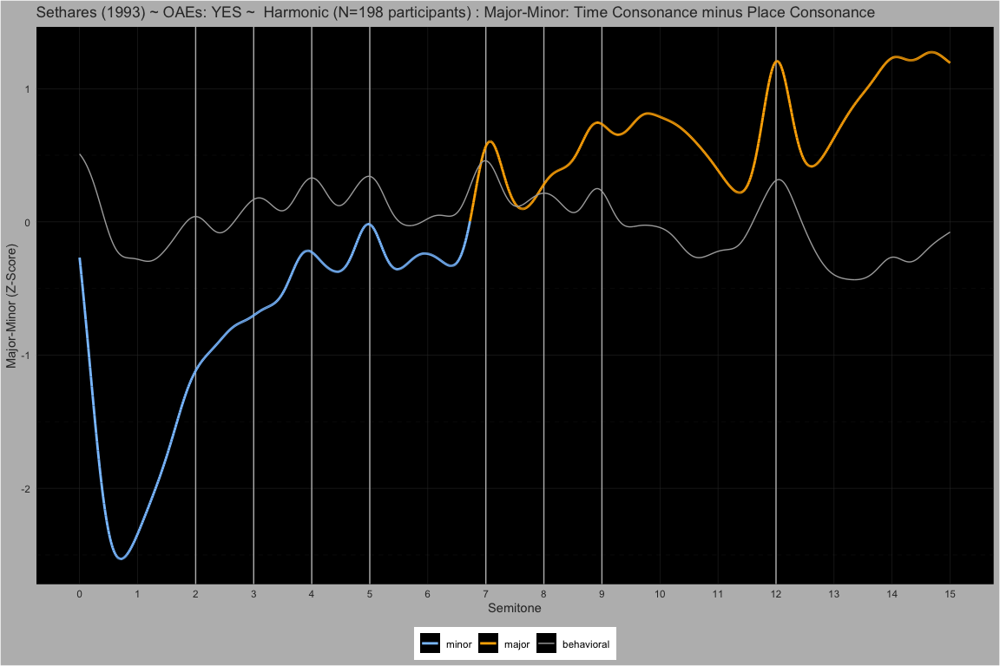
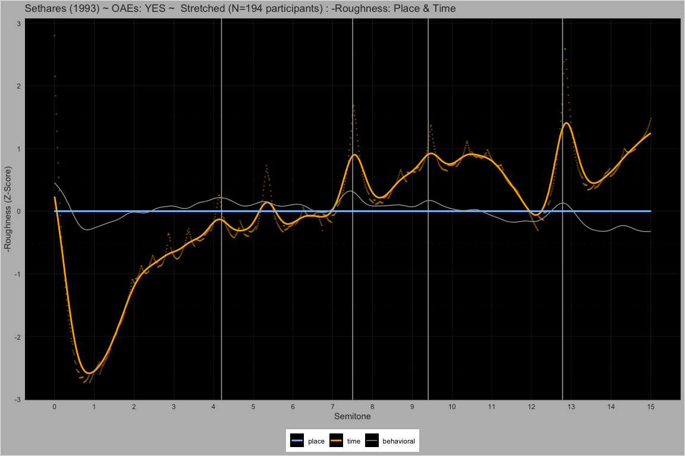

MaMi.CoDi.Beaty: A Model of Harmony Perception
================

# Behavioral

## Manipulating Harmonic Frequencies

##### Harmonic ~ Partials: 10

<!-- -->  
<!-- -->  
<!-- -->

##### 5Partials ~ Partials: 5

<!-- -->  
<!-- -->  
<!-- -->

##### 5PartialsNo3 ~ Partials: 5

<!-- -->  
<!-- -->  
<!-- -->

##### Bonang ~ Partials: 4

<!-- -->  
<!-- -->  
<!-- -->

#### Dyads spanning 15 semitones

##### Pure ~ Partials: 1

<!-- -->  
<!-- -->  
<!-- -->

##### Stretched ~ Partials: 10

<!-- -->  
<!-- -->  
<!-- -->

##### Compressed ~ Partials: 10

<!-- -->  
<!-- -->  
<!-- -->

#### Dyads spanning 1 quarter tone

##### M3 ~ Partials: 10

<!-- -->  
<!-- -->  
<!-- -->

##### M6 ~ Partials: 10

<!-- -->  
<!-- -->  
<!-- -->

##### P8 ~ Partials: 10

<!-- -->  
<!-- -->  
<!-- -->

# Theory

## Heisenberg Uncertainty

$$
\Delta x \Delta p \ge \frac{\hbar}{2}, \quad p = \frac{h}{\lambda}
$$

## Gabor Uncertainty

$$
\Delta t \Delta \omega \ge \frac{1}{2}
$$

## Relative Uncertainty

### Reference Time Period

$$
\Delta t = T = \frac{2 \pi }{\omega} = n \frac{2 \pi }{\omega_{ref}}, \quad n \enspace \text{periods}
$$ $$
\Delta t \Delta \omega = T \Delta \omega = n \frac{2 \pi}{\omega_{ref}}\Delta \omega \ge \frac{1}{2}
$$

### Relative Frequency Uncertainty

$$
\frac{\Delta \omega}{\omega_{ref}} \ge \frac{1}{4 \pi n}
\quad \text{and} \quad
\frac{\Delta f}{f_{ref}} \ge \frac{1}{4 \pi n}
$$

#### Weber’s law (just-noticeable relative threshold)

$$
\frac{\Delta f}{f_{\rm ref}} = k,
\quad
k = \frac{1}{4\pi n} \quad \text{Weber's Constant}
$$

## Relative Rational Approximation Uncertainty

### Idealized Frequency and Approximate Frequency

$$
\Delta f = \bigl| f - \widetilde f \bigr|
$$

$$
\begin{align*}
f \; \text{is an idealized frequency} \\
\widetilde f \; \text{is an approximate frequency}
\end{align*}
$$

### Rational Approximation

$$
\widetilde f = f_{ref} \frac{a}{b}, \quad a \in \mathbb{Z},  b \in  \mathbb{N}
$$

### Rational Approximation Uncertainty

$$
\Delta f = \bigl| f - \widetilde f \bigr|
= \bigl| f - f_{ref}  \frac{a}{b} \bigr|
= f_{ref} \bigl| \tfrac{f}{f_{ref}} - \tfrac{a}{b}\bigr|
$$

$$
\bigl| \tfrac{f}{f_{ref}} - \tfrac{a}{b}\bigr| \ge \frac{1}{4 \pi n}
$$

## Stern-Brocot: Traversal

$$
\begin{aligned}
&\mathbf{WHILE}\;\Bigl|\tfrac{f}{f_{\mathrm{ref}}}-\tfrac{a}{b}\Bigr| \ge \tfrac{1}{4\pi n}
\quad\mathbf{DO}\\
&\quad a  \gets  a_{\mathrm{left}} + a_{\mathrm{right}}\\
&\quad b  \gets  b_{\mathrm{left}} + b_{\mathrm{right}}\\
&\quad \mathbf{IF}\;\tfrac{f}{f_{\mathrm{ref}}} > \tfrac{a}{b}\;\mathbf{THEN}\\
&\quad\quad a_{\mathrm{left}} \gets a,\quad b_{\mathrm{left}} \gets b\\
&\quad \mathbf{ELSE}\\
&\quad\quad a_{\mathrm{right}} \gets a,\quad b_{\mathrm{right}} \gets b\\
&\quad \mathbf{END\_IF}\\
&\quad \delta \gets \delta + 1\\
&\mathbf{END\_WHILE}
\end{aligned}
$$

### Stern–Brocot: Rational Fractions Lowest Terms

$$
a \perp b \quad \Longrightarrow \quad  \mathrm{gcd}(a,b)=1
$$

### Stern–Brocot: Total Traversal Depth for All Tones in a N-Tone Chord

$$
\Delta \;=\; \sum_{i=1}^{N} \delta_{i}
$$

## Fundamental Frequency of a N-Tone Chord

$$
f_0 = f_{ref}\frac{\mathrm{gcd}(a_1, a_2, \dots, a_N)}{\mathrm{lcm}(b_1, b_2, \dots, b_N)}, \quad a_i \perp b_i
$$

## Fundamental Wavelength of a N-Tone Chord

$$
\lambda_0 = \lambda_{ref}\frac{\mathrm{gcd}(a_1, a_2, \dots, a_N)}{\mathrm{lcm}(b_1, b_2, \dots, b_N)}, \quad a_i \perp b_i
$$

## Stolzenburg Periodicity Perception

### Fundamental Cycle Length of a N-Tone Chord

$$
\Lambda  = \mathrm{lcm}(b_1,b_2,\dots,b_N)
\quad\text{when}\quad
\gcd(a_1,\dots,a_N)=1
$$

### Psychophysical Periodicity

$$
\psi  = \log_2 \bigl(\Lambda\bigr) \quad \bigl[\text{units: Sz}\bigr]
$$

#### Fechner’s law (logarithmic sensation scaling)

$$
\psi = C \,\log_2\!\bigl(\tfrac{\Lambda}{\Lambda_0}\bigr)
$$

##### Special case: recover “bits of periodicity”

By choosing  
- $C = 1$  
- $\Lambda_0 = 1$

Fechner’s law reduces exactly to the psychophysical periodicity
definition:

$$
\psi = 1 \,\log_2\!\bigl(\Lambda / 1\bigr)
\;=\;
\log_2(\Lambda)
$$

###### Justification for $C$

We set $C=1$ because we are working with a purely relative scale—each
doubling of $\Lambda$ maps to exactly one Sz unit with no additional
gain factor.

###### Justification for $\Lambda_0$

We choose $\Lambda_0=1$ to anchor the zero‐point of perception at a
single cycle, so that $\psi=0$ precisely when the stimulus contains one
cycle.

#### Major-Minor: Temporal and Spatial Periodicity Difference

$$
\Psi_{MaMi}  = \psi_{t} - \psi_{x} \quad \bigl[\text{units: Sz}\bigr]
$$

#### Consonance-Dissonance: Temporal and Spatial Periodicity Sum

$$
\Psi_{CoDi}  = \psi_{t} + \psi_{x} \quad \bigl[\text{units: Sz}\bigr]
$$

#### Beating: Stern-Brocot Traversal Depth

$$
\Psi_{Beaty} = \log_{2}(\Delta)
$$

## Pseudo-Octaves: Perception of Stretching and Compressing

### Heuristic to Find Pseudo Octave of a N-Tone Chord

$$
\begin{aligned}
&\mathbf{FOR}\; i \gets 1 \;\mathbf{TO}\; N \;\mathbf{DO}\\
&\quad \mathbf{FOR}\; j \gets i+1 \;\mathbf{TO}\; N \;\mathbf{DO}\\
&\quad\quad \mathrm{approximation} \gets \dfrac{\mathrm{ratios}[i]}{\mathrm{ratios}[j]}\\
&\quad\quad \mathrm{ideal} \gets \mathrm{round}(\mathrm{approximation})\\
&\quad\quad \mathbf{IF}\;\dfrac{\lvert \mathrm{ideal} - \mathrm{approximation}\rvert}{\mathrm{ideal}} < \log_{2}\!\bigl(1 + \tfrac{1}{4\pi n}\bigr)\;\mathbf{THEN}\\
&\quad\quad\quad \mathrm{octave_{\mathrm{pseudo}}} \gets 2^{\frac{\ln(\mathrm{approximation})}{\ln(\mathrm{ideal})}}\\
&\quad\quad\quad \mathrm{candidates} \gets \mathrm{candidates} \cup \{\mathrm{octave_{\mathrm{pseudo}}}\}\\
&\quad\quad \mathbf{END\_IF}\\
&\quad \mathbf{END\_FOR}\\
&\mathbf{END\_FOR}\\
&\mathbf{RETURN}\;\mathrm{most\_frequent}(\mathrm{candidates})\\
\end{aligned}
$$
