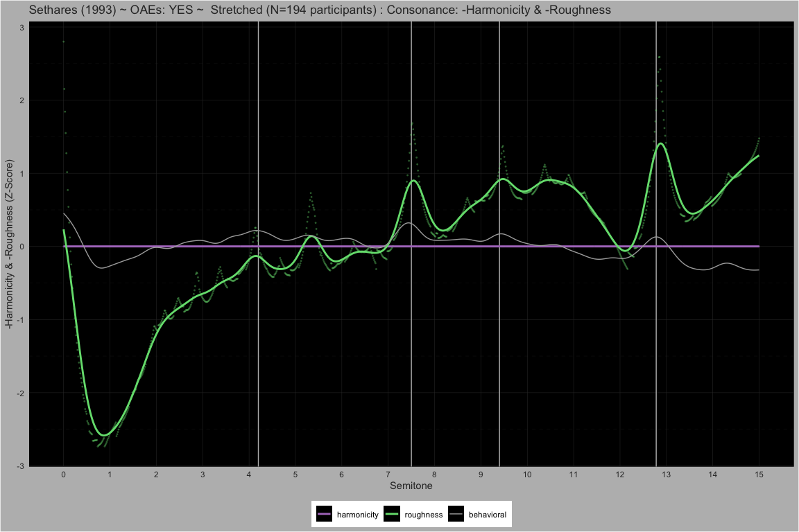
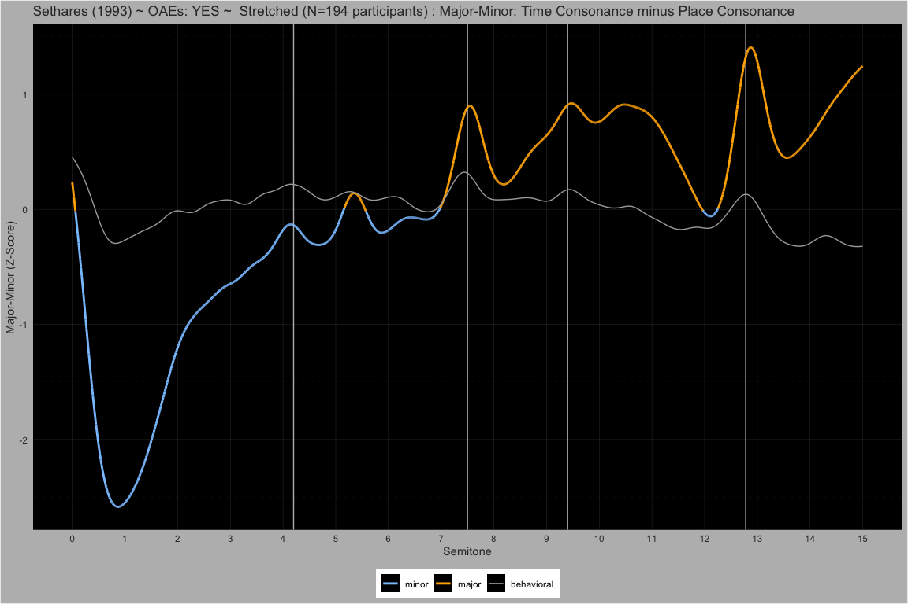

\_04_pf_pl_rf_rl MaMi.CoDi.Beaty: A Model of Harmony Perception
================

# Behavioral

## Manipulating Harmonic Frequencies

#### Dyads spanning 15 semitones

##### Pure ~ Partials: 1

<!-- -->  
<!-- -->  
<!-- -->

##### 5Partials ~ Partials: 5

<!-- -->  
<!-- -->  
<!-- -->

##### 5PartialsNo3 ~ Partials: 5

<!-- -->  
<!-- -->  
<!-- -->

##### Harmonic ~ Partials: 10

<!-- -->  
<!-- -->  
<!-- -->

#### Dyads spanning 1 quarter tone

##### M3 ~ Partials: 10

<!-- -->  
<!-- -->  
<!-- -->

##### M6 ~ Partials: 10

<!-- -->  
<!-- -->  
<!-- -->

##### P8 ~ Partials: 10

<!-- -->  
<!-- -->  
<!-- -->

##### Stretched ~ Partials: 10

<!-- -->  
<!-- -->  
<!-- -->

##### Compressed ~ Partials: 10

<!-- -->  
<!-- -->  
<!-- -->

##### Bonang ~ Partials: 4

<!-- -->  
<!-- -->  
<!-- -->

# Theory

## Heisenberg Uncertainty

$$
\Delta x \Delta p \ge \frac{\hbar}{2}, \quad p = \frac{h}{\lambda}
$$

## Gabor Uncertainty

$$
\Delta t \Delta \omega \ge \frac{1}{2}
$$

## Relative Uncertainty

### Reference Time Period

$$
\Delta t = n T = n \frac{2 \pi }{\omega_{ref}}, \quad n \enspace \text{periods}
$$

NOTE: For our consonance modeling we use $n=1$ for all computations, but
we leave $n$ throughout this text for completeness.

$$
\Delta t \Delta \omega = n T \Delta \omega = n \frac{2 \pi}{\omega_{ref}}\Delta \omega \ge \frac{1}{2}
$$

### Relative Frequency Uncertainty

$$
\frac{\Delta \omega}{\omega_{ref}} \ge \frac{1}{4 \pi n}
$$

$$
\boxed 
{
\frac{\Delta f}{f_{ref}} \ge \frac{1}{4 \pi n}
}
$$

## Relative Rational Approximation Uncertainty

### Idealized Frequency and Approximate Frequency

$$
\Delta f = \bigl| \widetilde f - f \bigr|
$$

$$
\begin{align*}
\widetilde f   \text{is an approximate frequency} \\
f   \text{is an idealized frequency} \\
\end{align*}
$$

### Rational Approximation

$$
\widetilde f = f_{ref} \frac{a}{b}, \quad a \in \mathbb{Z},  b \in  \mathbb{N}
$$

### Rational Approximation Uncertainty

$$
\Delta f = \bigl| \widetilde f - f \bigr|
= \bigl| f_{ref}  \frac{a}{b} - f\bigr|
= \frac{f_{ref}}{f_{ref}} \bigl| f_{ref} \frac{a}{b} - f \bigr|
= f_{ref} \bigl| \tfrac{a}{b} - \tfrac{f}{f_{ref}}\bigr|
$$

$$
\frac{\Delta f}{f_{ref}} = 
\frac{f_{ref} \bigl| \frac{a}{b} - \frac{f}{f_{ref}} \bigr|}{f_{ref}} \ge \frac{1}{4 \pi n}
$$

$$
\boxed {
\bigl| \frac{a}{b} - \tfrac{f}{f_{ref}} \bigr| \ge \frac{1}{4 \pi n}
}
$$

## Stern-Brocot: Traversal

$$
\begin{aligned}
&\mathbf{WHILE} 
\boxed {
\Bigl|\tfrac{a}{b} - \tfrac{f}{f_{\mathrm{ref}}}\Bigr| \ge \tfrac{1}{4\pi n}
}
\quad\mathbf{DO}\\
&\quad a  \gets  a_{\mathrm{left}} + a_{\mathrm{right}}\\
&\quad b  \gets  b_{\mathrm{left}} + b_{\mathrm{right}}\\
&\quad \mathbf{IF} \tfrac{f}{f_{\mathrm{ref}}} > \tfrac{a}{b} \mathbf{THEN}\\
&\quad\quad a_{\mathrm{left}} \gets a,\quad b_{\mathrm{left}} \gets b\\
&\quad \mathbf{ELSE}\\
&\quad\quad a_{\mathrm{right}} \gets a,\quad b_{\mathrm{right}} \gets b\\
&\quad \mathbf{END\_IF}\\
&\quad d \gets d + 1\\
&\mathbf{END\_WHILE}
\end{aligned}
$$

### Stern-Brocot Example

To find the rational approximation of two example frequencies
$f = 850.28, \quad f_{ref} = 260.0$, we traverse the Stern–Brocot tree
six levels down along the path *RRRRLL* landing us on the fraction
$\frac{10}{3}$.

$$
\bigl| \tfrac{850.28}{260.0} - \tfrac{10}{3}\bigr| = 
\bigl| 3.270308 - 3.333333 \bigr| =
0.063025 < 
\frac{1}{4 \pi} =
0.079577
$$

<!-- -->

### Stern–Brocot: Total Traversal Depth for All Tones in a N-Tone Chord

$$
D  =  \sum_{i=1}^{N} d_{i}
$$

### Stern–Brocot: Rational Fractions Lowest Terms

$$
a \perp b \quad \Longrightarrow \quad  \mathrm{gcd}(a,b)=1
$$

## Fundamental Frequency of a N-Tone Chord

$$
f_0 = f_{ref}\frac{\mathrm{gcd}(a_1, a_2, \dots, a_N)}{\mathrm{lcm}(b_1, b_2, \dots, b_N)}, \quad f_{ref} = \mathrm{min}(f_1, f_2, \dots, f_N), \quad a_i \perp b_i
$$

## Fundamental Wavelength of a N-Tone Chord

$$
\lambda_0 = \lambda_{ref}\frac{\mathrm{gcd}(a_1, a_2, \dots, a_N)}{\mathrm{lcm}(b_1, b_2, \dots, b_N)}, \quad \lambda_{ref} = \mathrm{min}(\lambda_1, \lambda_2, \dots, \lambda_N), \quad a_i \perp b_i
$$

## Stolzenburg Periodicity Perception

### Fundamental Cycle Length of a N-Tone Chord

$$
L  = \mathrm{lcm}(b_1,b_2,\dots,b_N)
\quad\text{when}\quad
\gcd(a_1,\dots,a_N)=1
$$

### Periodicity: Rational Approximation Cycle Length

$$
P_f  = \log_2 \bigl(L_f\bigr) \quad \text{and} \quad P_\lambda  = \log_2 \bigl(L_\lambda\bigr) \quad \text{[Proposed Units: Sz]}
$$

### Roughness: Stern-Brocot Traversal Depth

$$
R_f  = \log_2 \bigl(D_f\bigr) \quad \text{and} \quad R_\lambda  = \log_2 \bigl(D_\lambda\bigr)
$$

### Overall Frequency Dissonance

$$
\psi_f = P_f + R_f
$$

### Overall Wavelength Dissonance

$$
\psi_\lambda = P_\lambda + R_\lambda
$$

### Consonance-Dissonance: Frequency and Wavelength Dissonance Sum

$$
\boxed{
\Psi_{CoDi}  = \psi_\lambda + \psi_f
}
$$

### Major-Minor: Frequency and Wavelength Dissonance Difference

$$
\boxed {
\Psi_{MaMi}  = \psi_\lambda - \psi_f
}
$$

### Beating: Frequency and Wavelength Roughness

$$
\boxed{
\Psi_{Beaty}  = R_\lambda + R_f
}
$$

## Pseudo-Octaves: Perception of Stretching and Compressing

### Relative Octave Uncertainty

$$
\frac{\Delta O}{O_{ref}} \ge \frac{1}{4\pi n}
$$

$$
\frac{|\tilde O - O|}{O_{ref}} \ge \frac{1}{4\pi n}
$$

$$
|\log_{2} \tilde O - \log_{2} O| = \log_{2}\Bigl(1 + \frac{| \tilde O - O|}{O_{ref}}\Bigr)
$$

$$
\log_{2}\Bigl(1 + \frac{|\tilde O - O|}{O_{ref}}\Bigr) \ge \log_{2}\Bigl(1 + \frac{1}{4\pi n}\Bigr)
$$

$$
\boxed{\frac{|\log_{2}( \tilde O) - \log_{2}( O)|} {\log_{2}(O_{ref})} \ge \log_{2}\Bigl(1 + \frac{1}{4\pi n}\Bigr)}
$$

### Heuristic to Find Pseudo Octave of a N-Tone Chord

$$
\begin{aligned}
&\mathbf{FOR} i\gets 1 \mathbf{TO} N \mathbf{DO}\\
&\quad \mathbf{FOR} j\gets i+1 \mathbf{TO} N \mathbf{DO}\\
&\quad\quad approximation \gets \dfrac{r_{j}}{r_{i}}\\
&\quad\quad ideal \gets \mathrm{round}(approximation)\\
&\quad\quad \mathbf{UNLESS}
\boxed{\dfrac{ \bigl\lvert \log_{2}(ideal) - \log_{2}(approximation) \bigr \rvert }{ \log_{2}(2.0) } \ge \log_{2}\bigl(1+\tfrac{1}{4\pi n}\bigr) }
\mathbf{THEN}\\
&\quad\quad\quad octave_{\mathrm{pseudo}}\gets  
2.0^{\frac{\log_{2}(approximation)}{\log_{2}(ideal)}}\\
&\quad\quad\quad candidates\gets candidates\cup\{octave_{\mathrm{pseudo}}\}\\
&\quad\quad \mathbf{END\_UNLESS}\\
&\quad \mathbf{END\_FOR}\\
&\mathbf{END\_FOR}\\
&\mathbf{RETURN} most\_frequent(candidates)
\end{aligned}
$$

# Appendix A: Relative Wavelength Uncertainty

$$
\Delta x \Delta k \ge \frac{1}{2}
$$

$$
k = \frac{2\pi}{\lambda} = 2 \pi \lambda^-1
$$

$$
\Delta k = 
\left|\frac{dk}{d\lambda}\right|\Delta\lambda =
\left|\frac{d (2 \pi \lambda^{-1})}{d\lambda}\right|\Delta\lambda = 
2 \pi \lambda^{-2} \Delta \lambda =
\frac{2\pi}{\lambda^2}\Delta\lambda
$$

$$
\Delta x \frac{2\pi}{\lambda^2}\,\Delta\lambda \ge \frac{1}{2}
$$

$$
\Delta x = n \lambda_{ref}, \quad n \enspace \text{wavelengths}
$$

$$
\Delta x \frac{2\pi}{\lambda^2} \Delta\lambda =
n \lambda_{ref} \frac{2\pi}{\lambda^2_{ref}} \Delta\lambda =
n \frac{2 \pi \Delta \lambda}{\lambda_{ref}} 
 \ge \frac{1}{2}
$$

$$
\boxed{
\frac{\Delta \lambda}{\lambda_{ref}} 
 \ge \frac{1}{4 \pi n}
}
$$

# Appendix B: Related Theories

## Gabor Wavelets from Rational Approximations

<!-- -->  
<!-- -->

### Daugman’s Gabor Wavelet in Computer Vision

John Daugman pioneered the use of Gabor wavelets for image analysis in
computer vision.

### Shamma’s Spectro-Temporal Analogy Between 2D Vision and 2D Hearing

Shamma proposed that the auditory system utilizes two-dimensional
spectro-temporal receptive fields—processing sound across both time and
frequency—analogous to how the visual system processes images in two
spatial dimensions.

## Weber’s law

$$
\frac{\Delta f}{f_{\rm ref}} = k,
\quad
k = \frac{1}{4\pi n} \quad \text{Weber's Constant}
$$

## Fechner’s law

$$
\psi = C  \log_2 \bigl(\tfrac{\Lambda}{\Lambda_0}\bigr)
$$

$$C = 1 \quad \text{and} \quad \Lambda_0 = 1$$

$$\psi = 1  \log_2 \bigl(\Lambda / 1\bigr) = \log_2(\Lambda)$$

#### Justification for C

We set $C=1$ because we are working with a purely relative scale—each
doubling of $\Lambda$ maps to exactly one Sz unit with no additional
gain factor.

#### Justification for $\Lambda_0$

We choose $\Lambda_0=1$ to anchor the zero‐point of perception at a
single cycle, so that $\psi=0$ precisely when the stimulus contains one
cycle.

## Information-Theoretic Perspective

### Bits of Periodicity as Shannon Information

Because

$$\psi = \log_2(\Lambda)$$

is literally a count of doublings (bits), we can interpret $\psi$ as the
**information content** of the chord’s periodic structure. Each Sz is
one bit of periodic pattern: doubling $\Lambda$ adds exactly one bit.

### Spectral Entropy

To capture the *uncertainty* or *complexity* of the harmonic spectrum
itself, define a probability distribution over your $N$ partials
(e.g. normalized amplitudes $p_i$). Then Shannon entropy

$$H = -\sum_{i=1}^N p_i \log_2(p_i)$$

measures how “spread out” or unpredictable the spectral content
is—linking timbral complexity directly to information theory.

### Channel-Capacity Analogy

If the listener’s auditory system is viewed as a communication channel
with an effective **bandwidth** $B$ (in Sz) and a signal-to-noise ratio
$\mathrm{SNR}$ tied to your Weber threshold, then Shannon’s channel
capacity

$$C = B  \log_2 \bigl(1 + \mathrm{SNR}\bigr)$$

gives an upper bound on how many bits per second of periodicity can be
resolved.
