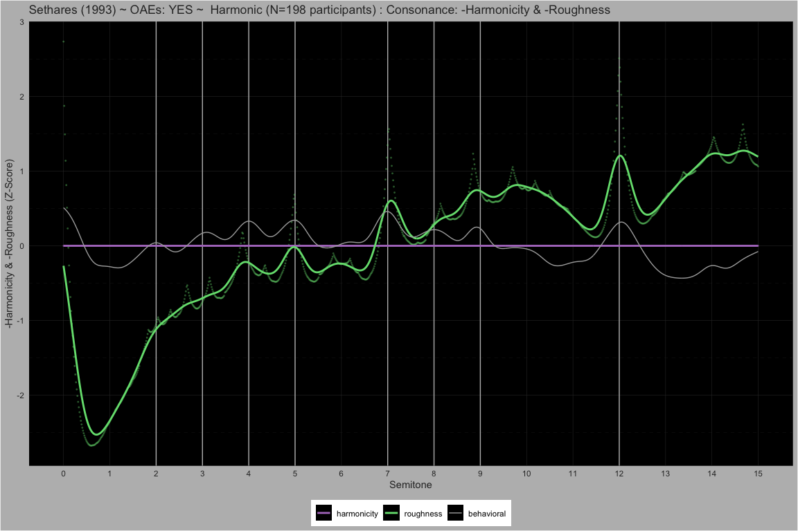
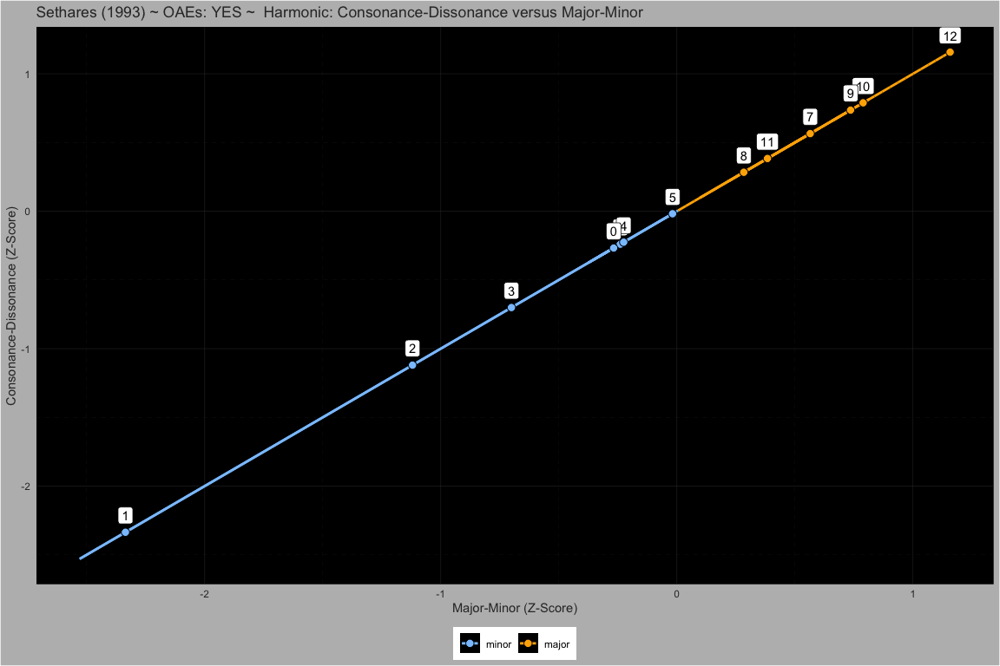
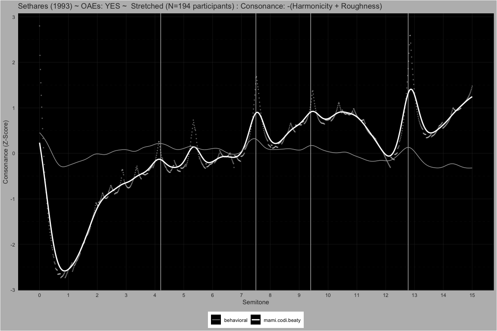
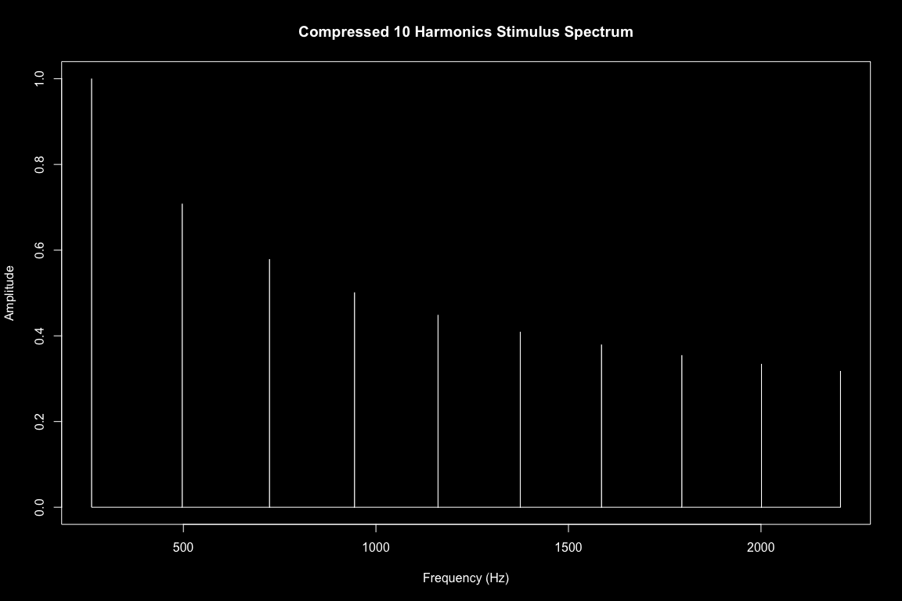
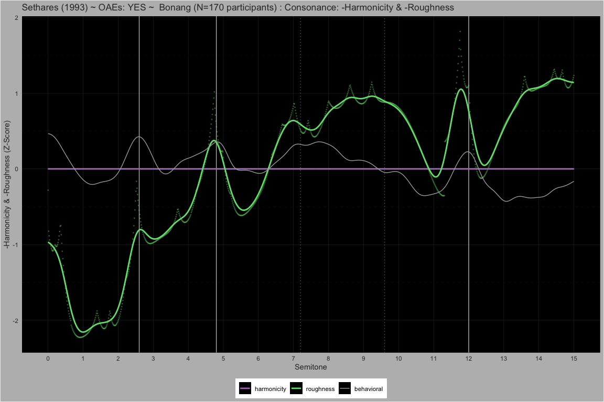

MaMi.CoDi.Beaty: A Model of Harmony Perception
================

# Behavioral

## Manipulating Harmonic Frequencies

##### Harmonic ~ Partials: 10

<!-- -->  
<!-- -->  
<!-- -->  
<!-- -->

##### 5Partials ~ Partials: 5

<!-- -->  
<!-- -->  
<!-- -->  
<!-- -->

##### 5PartialsNo3 ~ Partials: 5

<!-- -->  
<!-- -->  
<!-- -->  
<!-- -->

##### Bonang ~ Partials: 4

<!-- -->  
<!-- -->  
<!-- -->  
<!-- -->

#### Dyads spanning 15 semitones

##### Pure ~ Partials: 1

<!-- -->  
<!-- -->  
<!-- -->  
<!-- -->

##### Stretched ~ Partials: 10

<!-- -->  
<!-- -->  
<!-- -->  
<!-- -->

##### Compressed ~ Partials: 10

<!-- -->  
<!-- -->  
<!-- -->  
<!-- -->

#### Dyads spanning 1 quarter tone

##### M3 ~ Partials: 10

<!-- -->  
<!-- -->  
<!-- -->  
<!-- -->

##### M6 ~ Partials: 10

<!-- -->  
<!-- -->  
<!-- -->  
<!-- -->

##### P8 ~ Partials: 10

<!-- -->  
<!-- -->  
<!-- -->  
<!-- -->

# Theory

## Heisenberg Uncertainty

$$
\Delta x \Delta p \ge \frac{\hbar}{2}
$$

## Gabor Uncertainty

$$
\Delta t \Delta \omega \ge \frac{1}{2}
$$

## Relative Uncertainty

### Reference Time Period

$$
\Delta t = T_{ref} = \frac{2 \pi}{\omega_{ref}}
$$ $$
\Delta t \Delta \omega = T_{ref} \Delta \omega = \frac{2 \pi}{\omega_{ref}} \Delta \omega \ge \frac{1}{2}
$$

### Relative Uncertainty Principle

$$
\frac{\Delta \omega}{\omega_{ref}} \ge \frac{1}{4 \pi} \quad \text{and} \quad \frac{\Delta f}{f_{ref}} \ge \frac{1}{4 \pi}\
$$

## Rational Approximation Uncertainty

### Relative Rational Approximation

$$
\Delta f = \bigl| f - \widetilde f \bigr| \quad \text{where} \quad \widetilde f = f_{ref} \frac{a}{b} \quad
\text{and} \quad a \in \mathbb{Z}, b \in \mathbb{N}
$$

$$
\Delta f = f_{ref} \bigl| \frac{f}{f_{ref}} - \frac{a}{b} \bigr|
$$

### Rational Approximation Uncertainty Principle

$$
\frac{\Delta f}{f_{ref}} =  \frac{f_{ref} \bigl| \frac{f}{f_{ref}} - \frac{a}{b} \bigr|}{f_{ref}}  = \bigl| \frac{f}{f_{ref}} - \frac{a}{b}\bigr| \ge \frac{1}{4 \pi}
$$

$$
\bigl| \frac{f}{f_{ref}} - \frac{a}{b}\bigr| \ge \frac{1}{4 \pi}
$$

## Stern-Brocot Traversal

$$
\begin{aligned}
&\mathbf{WHILE} \Bigl|\tfrac{f}{f_{\mathrm{ref}}}-\tfrac{a}{b}\Bigr| \ge \tfrac{1}{4\pi}
\quad\mathbf{DO}\\
&\quad a  \gets  a_{\mathrm{left}} + a_{\mathrm{right}}\\
&\quad b  \gets  b_{\mathrm{left}} + b_{\mathrm{right}}\\
&\quad \mathbf{IF} \tfrac{f}{f_{\mathrm{ref}}} > \tfrac{a}{b} \mathbf{THEN}\\
&\quad\quad a_{\mathrm{left}} \gets a,\quad b_{\mathrm{left}} \gets b\\
&\quad \mathbf{ELSE}\\
&\quad\quad a_{\mathrm{right}} \gets a,\quad b_{\mathrm{right}} \gets b\\
&\quad \mathbf{END\_IF}\\
&\mathbf{END\_WHILE}
\end{aligned}
$$

$$
a \perp b \quad \Longrightarrow \quad  \mathrm{gcd}(a,b)=1
$$

## Fundamental Frequency

$$
f_0 = f_{ref}\frac{\mathrm{gcd}(a_1, a_2, \dots, a_n)}{\mathrm{lcm}(b_1, b_2, \dots, b_n)}, \quad a_i \perp b_i
$$

## Stolzenburg Periodicity Perception

### Fundamental Cycle Length

$$
\Lambda  = \mathrm{lcm}(b_1,b_2,\dots,b_n) \quad \text{when} \quad \gcd(a_1,\dots,a_n)=1
$$

### Psychophysical Periodicity

$$
\Psi  = \log_2\!\bigl(\Lambda\bigr) \quad \bigl[\text{units: Sz}\bigr]
$$
