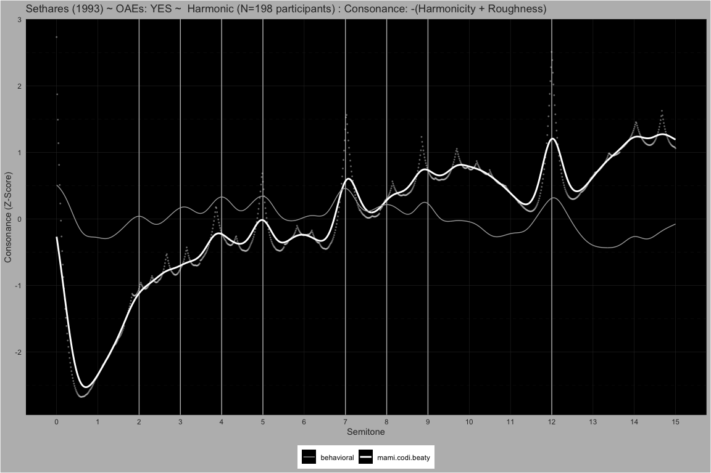

MaMi.CoDi: A Model of Harmony Perception
================

# Behavioral

## Manipulating Harmonic Frequencies

##### P8 ~ Partials: 10

Description is below.

| cochlear_amplifier_num_harmonics | time_uncertainty | space_uncertainty | smoothing_sigma | pseudo_octave |
|---:|:---|:---|---:|---:|
| 2 | 0.07958 | 0.07958 | 0.035 | 2 |

<!-- -->  
<!-- -->  
<!-- -->  
<!-- -->  
<!-- -->
