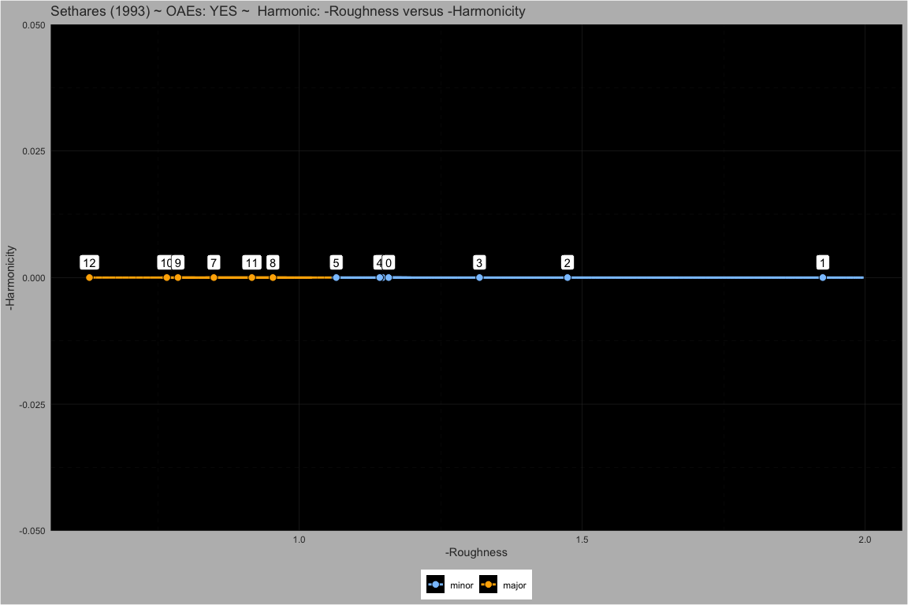
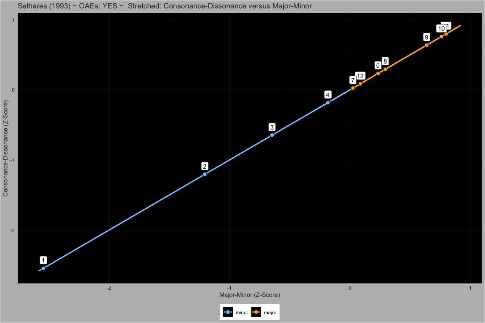
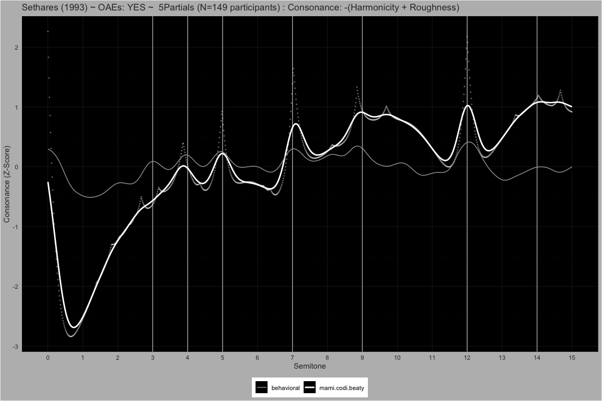
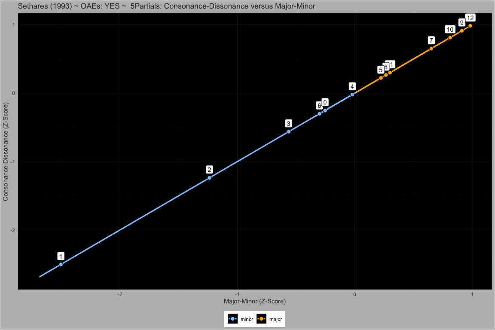
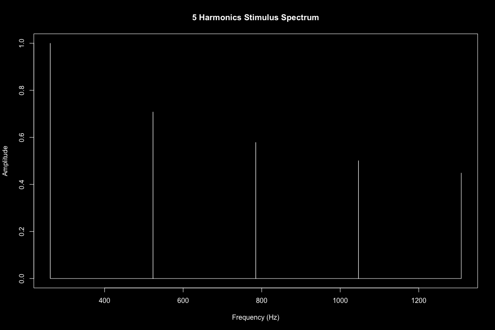
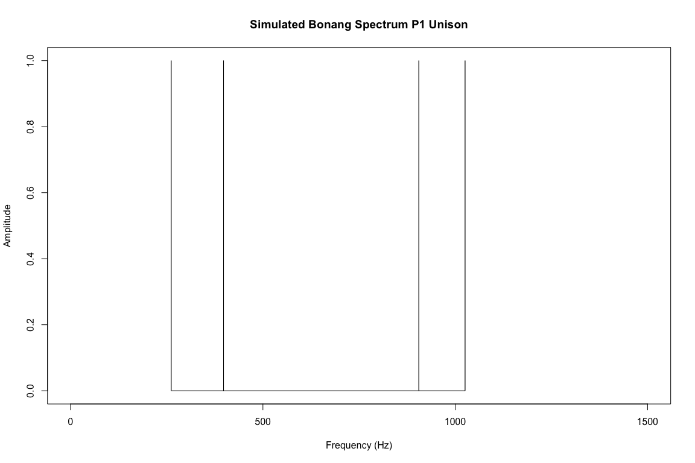
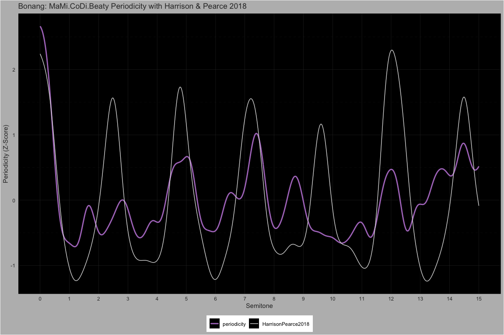

MaMi.CoDi.Beaty: A Model of Harmony Perception
================

# The Behavioral Data

## Manipulating Harmonic Frequencies

#### Dyads spanning 15 semitones

##### Pure ~ Partials: 1

<!-- -->  
<!-- -->  
<!-- -->  
<!-- -->

##### 5Partials ~ Partials: 5

<!-- -->  
<!-- -->  
<!-- -->  
<!-- -->

##### 5PartialsNo3 ~ Partials: 5

<!-- -->  
<!-- -->  
<!-- -->  
<!-- -->

##### Harmonic ~ Partials: 10

<!-- -->  
<!-- -->  
<!-- -->  
<!-- -->

#### Dyads spanning 1 quarter tone

##### M3 ~ Partials: 10

<!-- -->  
<!-- -->  
<!-- -->  
<!-- -->

##### M6 ~ Partials: 10

<!-- -->  
<!-- -->  
<!-- -->  
<!-- -->

##### P8 ~ Partials: 10

<!-- -->  
<!-- -->  
<!-- -->  
<!-- -->

##### Stretched ~ Partials: 10

<!-- -->  
<!-- -->  
<!-- -->  
<!-- -->

##### Compressed ~ Partials: 10

<!-- -->  
<!-- -->  
<!-- -->  
<!-- -->

##### Bonang ~ Partials: 4

<!-- -->  
<!-- -->  
<!-- -->  
<!-- -->

# Fourier uncertainty principle in number‑theoretic form matches musical consonance perception

## Heisenberg Uncertainty

$$
\Delta x \Delta p \ge \frac{\hbar}{2}, \quad p = \frac{h}{\lambda}
$$

## Gabor Uncertainty

$$
\Delta t \Delta \omega \ge \frac{1}{2}
$$

## Relative Uncertainty

### Reference Time Period

$$
\Delta t = n T = n \frac{2 \pi }{\omega_{ref}}, \quad n \enspace \text{periods}
$$

$$
n \frac{2 \pi}{\omega_{ref}}\Delta \omega \ge \frac{1}{2}
$$

### Relative Frequency Uncertainty

$$
\frac{\Delta \omega}{\omega_{ref}} \ge \frac{1}{4 \pi n}
$$

$$
\boxed 
{
\frac{\Delta f}{f_{ref}} \ge \frac{1}{4 \pi n}
}
$$

## Relative Rational Approximation Uncertainty

### Idealized Frequency and Approximate Frequency

$$
\Delta f = \bigl| \widetilde f - f \bigr|
$$

$$
\begin{align*}
\widetilde f   \text{is an approximate frequency} \\
f   \text{is an idealized frequency} \\
\end{align*}
$$

### Rational Approximation

$$
\widetilde f = f_{ref} \frac{a}{b}, \quad a \in \mathbb{Z},  b \in  \mathbb{N}
$$

### Rational Approximation Uncertainty

$$
\Delta f = 
\bigl| f_{ref}  \frac{a}{b} - f\bigr| = 
\frac{f_{ref}}{f_{ref}} \bigl| f_{ref} \frac{a}{b} - f \bigr| = 
f_{ref} \bigl| \tfrac{a}{b} - \tfrac{f}{f_{ref}}\bigr|
$$

$$
\frac{\Delta f}{f_{ref}} = 
\frac{f_{ref} \bigl| \frac{a}{b} - \frac{f}{f_{ref}} \bigr|}{f_{ref}} \ge \frac{1}{4 \pi n}
$$

$$
\boxed {
\bigl| \frac{a}{b} - \tfrac{f}{f_{ref}} \bigr| \ge \frac{1}{4 \pi n}
}
$$

## Stern-Brocot: Traversal

$$
\begin{aligned}
&\mathbf{WHILE} 
\boxed {
\Bigl|\tfrac{a}{b} - \tfrac{f}{f_{\mathrm{ref}}}\Bigr| \ge \tfrac{1}{4\pi n}
}
\quad\mathbf{DO}\\
&\quad a  \gets  a_{\mathrm{left}} + a_{\mathrm{right}}\\
&\quad b  \gets  b_{\mathrm{left}} + b_{\mathrm{right}}\\
&\quad \mathbf{IF} \tfrac{f}{f_{\mathrm{ref}}} > \tfrac{a}{b} \mathbf{THEN}\\
&\quad\quad a_{\mathrm{left}} \gets a,\quad b_{\mathrm{left}} \gets b\\
&\quad \mathbf{ELSE}\\
&\quad\quad a_{\mathrm{right}} \gets a,\quad b_{\mathrm{right}} \gets b\\
&\quad \mathbf{END\_IF}\\
&\quad d \gets d + 1\\
&\mathbf{END\_WHILE}
\end{aligned}
$$

### Stern-Brocot Example

Let’s find the rational approximation of two example frequencies that
form a Major 7th interval:

$$
f = 493.8833\ \text{(B4)}, 
\quad
f_{\mathrm{ref}} = 261.6256\ \text{(C4)}
$$

<!-- -->

We traverse the Stern–Brocot tree to a depth of **7** levels along the
path **RRLRRRR** landing us on the fraction $\frac{11}{6}$.

$$
\bigl| \tfrac{493.8833}{261.6256} - \tfrac{11}{6}\bigr| = 
\bigl| 1.8877  - 1.8333 \bigr| =
0.0544 < 
\frac{1}{4 \pi} =
0.0796
$$

<!-- -->

### Stern–Brocot: Rational Fractions Lowest Terms

$$
a \perp b \quad \Longrightarrow \quad  \mathrm{gcd}(a,b)=1
$$

## Fundamental Frequency of a N-Tone Chord

$$
f_0 = f_{ref}\frac{\mathrm{gcd}(a_1, a_2, \dots, a_N)}{\mathrm{lcm}(b_1, b_2, \dots, b_N)}, \quad f_{ref} = \mathrm{min}(f_1, f_2, \dots, f_N), \quad a_i \perp b_i
$$

### Rational Approximation Signal versus Idealized Signal

Idealized Frequencies:

$$f = \{261.63, 493.88\}$$

Equation for Rational Fraction Frequencies:

$$
\mathbf{f} = f_{ref} \bigl( \frac{a_i}{b_i},\frac{a_i}{b_i},\dots,\frac{a_N}{b_N} \bigr)
$$

Rational Fraction Frequencies:

$$f = \{261.63, 479.65\}$$

<!-- -->

<!-- -->

## But wait! I can hear that difference!

Yes, you can! Luckily for us, our auditory system is not a simple,
linear frequency sensor.

Our auditory system amplifies signals in a way that creates new tones.
Those tones give us more information that allows us to hear changes and
still over the uncertainty principle.

TODO: show this example again but with the cochlear distoration
products.

## Fundamental Wavelength of a N-Tone Chord

$$
\lambda_0 = \lambda_{ref} \frac{\mathrm{lcm}(b_1, b_2, \dots, b_N)}{\mathrm{gcd}(a_1, a_2, \dots, a_N)}, \quad \lambda_{ref} = \mathrm{min}(\lambda_1, \lambda_2, \dots, \lambda_N), \quad a_i \perp b_i
$$

## Stolzenburg Periodicity Perception

### Fundamental Cycle Length of a N-Tone Chord

$$
L  = \mathrm{lcm}(b_1,b_2,\dots,b_N)
\quad\text{when}\quad
\gcd(a_1,\dots,a_N)=1
$$

### Periodicity: Rational Approximation Cycle Length

$$
P_f  = \log_2 \bigl(L_f\bigr) \quad \text{and} \quad P_\lambda  = \log_2 \bigl(L_\lambda\bigr) \quad \text{[Proposed Units: Sz]}
$$

#### Bonang: MaMi.CoDi.Beaty Periodicity with Harrison & Pearce 2018

We use a simulated Bonang spectrum. Here is an example unison P1 pitch
at C4.

$$f = \{261.63, 397.67, 905.22, 1025.57\}$$

<!-- -->

<!-- -->

### Roughness: Stern-Brocot Traversal Depth

#### Stern–Brocot: Total Traversal Depth for All Tones in a N-Tone Chord

$$
D  =  \sum_{i=1}^{N} d_{i}
$$

#### Stern–Brocot: Psychophysical Measure of Roughness

$$
R_f  = \log_2 \bigl(D_f\bigr) \quad \text{and} \quad R_\lambda  = \log_2 \bigl(D_\lambda\bigr)
$$

#### Bonang: MaMi.CoDi.Beaty Roughness with Hutchinson & Knopoff 1978

<!-- -->

### Overall Frequency Dissonance

$$
\psi_f = P_f + R_f
$$

### Overall Wavelength Dissonance

$$
\psi_\lambda = P_\lambda + R_\lambda
$$

### Consonance-Dissonance: Frequency and Wavelength Dissonance Sum

$$
\boxed{
\Psi_{CoDi}  = \psi_\lambda + \psi_f
}
$$

### Major-Minor: Frequency and Wavelength Dissonance Difference

$$
\boxed {
\Psi_{MaMi}  = \psi_\lambda - \psi_f
}
$$

### Beating: Frequency and Wavelength Roughness

$$
\boxed{
\Psi_{Beaty}  = R_\lambda + R_f
}
$$

## Pseudo-Octaves: Stretching and Compressing Harmonics

### Relative Harmonics Uncertainty

$$
\frac{\Delta h}{h} =
\frac{\bigl| \tilde h - h \bigr|}{h} = 
\boxed{\frac{\bigl| \frac{f_j}{f_i} - \mathrm{round} \bigl( \frac{f_j}{f_i} \bigr) \bigr|}{\mathrm{round} \bigl( \frac{f_j}{f_i} \bigr)} \ge 
\frac{1}{4\pi n}}
$$

### Psuedo Octave from Harmonics

$$
\tilde \Omega =2^{\log_{h}\tilde h}
$$

### Log Base 2 Uncertainty Limit

What is the uncertainty limit for perceiving an octave?

$$
\log_2 \bigl( 1 + \frac{1}{4 \pi} \bigr) \approx 0.11
$$

$$
\tilde \Omega = \Omega \pm \log_2 \bigl( 1 + \frac{1}{4 \pi} \bigr) = \Omega \pm 0.11
$$

Aligns with Sethares experiments with octave stretching and compressing
from $1.9$ to $2.1$.

### Heuristic to Find Pseudo Octave of a N-Tone Chord from Harmonic Spacing within Uncertainty Limit

$$
\begin{aligned}
&\mathbf{FOR}\ i\gets 1\ \mathbf{TO}\ N\ \mathbf{DO}\\
&\quad\mathbf{FOR}\ j\gets i+1\ \mathbf{TO}\ N\ \mathbf{DO}\\
&\quad\quad \mathbf{IF}\ \mathrm{round}\bigl(\tfrac{r_{j}}{r_{i}}\bigr) < 2\ \mathbf{CONTINUE}\\
&\quad\quad \mathbf{UNLESS}\ \boxed{\frac{\lvert  \frac{r_{j}}{r_{i}} - \mathrm{round}( \frac{r_{j}}{r_{i}})\rvert}{\mathrm{round}( \frac{r_{j}}{r_{i}})} \ge \frac{1}{4\pi n}}\ \mathbf{THEN}\\
&\quad\quad\quad\quad candidate\_pseudo\_octave \gets \exp_{2}\!\bigl(\frac{\log(\tilde h)}{\log(h)}\bigr)\\
&\quad\quad\quad\quad candidates \gets candidates \cup \{pseudo\_octave\}\\
&\quad\quad\mathbf{END\_UNLESS}\\
&\quad\mathbf{END\_FOR}\\
&\mathbf{END\_FOR}\\
&\mathbf{RETURN}\ \mathbf{most\_frequent}(candidates)
\end{aligned}
$$

$$
\frac{f}{f_{\mathrm{ref}}}
\quad\mapsto\quad
\exp_{2}\biggl(\frac{\log_{2}\bigl(f/f_{\mathrm{ref}}\bigr)}{\log_{2}(\tilde \Omega)}\biggr)
$$

## Cubic Distortion Products

For all combinations of $f$ partials, we added the cubic distortion
products to the stimuli.

$$
2 f_{low} - f_{high}, \quad \text{where} \quad (f_{high} - f_{low}) < f_{min}
$$

# Appendix A: Relative Wavelength Uncertainty

$$
\Delta x \Delta k \ge \frac{1}{2}
$$

$$
k = \frac{2\pi}{\lambda} = 2 \pi \lambda^-1
$$

$$
\Delta k = 
\left|\frac{dk}{d\lambda}\right|\Delta\lambda =
\left|\frac{d (2 \pi \lambda^{-1})}{d\lambda}\right|\Delta\lambda = 
2 \pi \lambda^{-2} \Delta \lambda =
\frac{2\pi}{\lambda^2}\Delta\lambda
$$

$$
\Delta x \frac{2\pi}{\lambda^2}\,\Delta\lambda \ge \frac{1}{2}
$$

$$
\Delta x = n \lambda_{ref}, \quad n \enspace \text{wavelengths}
$$

$$
\Delta x \frac{2\pi}{\lambda^2} \Delta\lambda =
n \lambda_{ref} \frac{2\pi}{\lambda^2_{ref}} \Delta\lambda =
n \frac{2 \pi \Delta \lambda}{\lambda_{ref}} 
 \ge \frac{1}{2}
$$

$$
\boxed{
\frac{\Delta \lambda}{\lambda_{ref}} 
 \ge \frac{1}{4 \pi n}
}
$$

# Appendix B: Related Theories

## Gabor Wavelets from Rational Approximations

<!-- -->  
<!-- -->

### Daugman’s Gabor Wavelet in Computer Vision

John Daugman pioneered the use of Gabor wavelets for image analysis in
computer vision.

### Shamma’s Spectro-Temporal Analogy Between 2D Vision and 2D Hearing

Shamma proposed that the auditory system utilizes two-dimensional
spectro-temporal receptive fields—processing sound across both time and
frequency—analogous to how the visual system processes images in two
spatial dimensions.

## Weber’s law

$$
\frac{\Delta f}{f_{\rm ref}} = k,
\quad
k = \frac{1}{4\pi n} \quad \text{Weber's Constant}
$$

## Fechner’s law

$$
\psi = C  \log_2 \bigl(\tfrac{\Lambda}{\Lambda_0}\bigr)
$$

$$C = 1 \quad \text{and} \quad \Lambda_0 = 1$$

$$\psi = 1  \log_2 \bigl(\Lambda / 1\bigr) = \log_2(\Lambda)$$

#### Justification for C

We set $C=1$ because we are working with a purely relative scale—each
doubling of $\Lambda$ maps to exactly one Sz unit with no additional
gain factor.

#### Justification for $\Lambda_0$

We choose $\Lambda_0=1$ to anchor the zero‐point of perception at a
single cycle, so that $\psi=0$ precisely when the stimulus contains one
cycle.

## Information-Theoretic Perspective

### Bits of Periodicity as Shannon Information

The Stern-Brocot Tree traversals give us many binary encodings:

**RRLRRRR**

Seems like this could be fertile ground for exploration.
